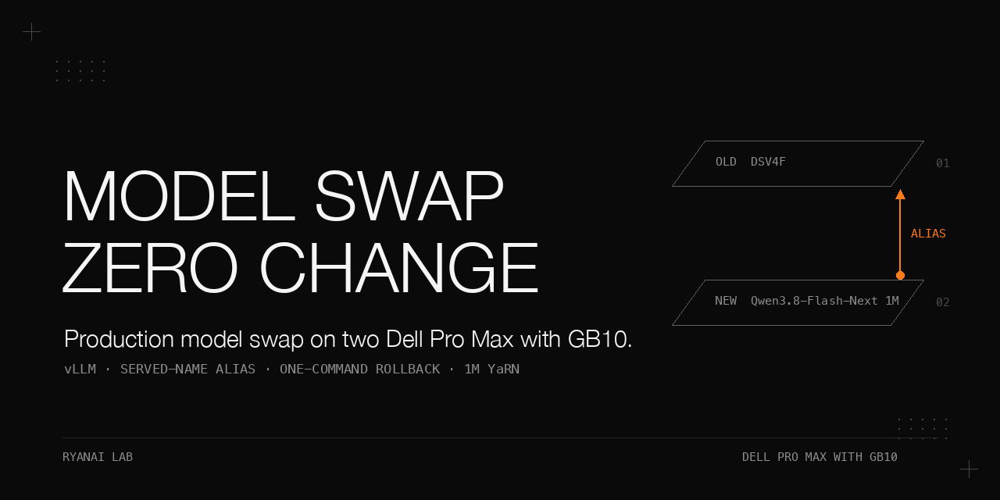

# Zero-client-change production model swap on two Dell Pro Max with GB10

> A two-node tensor-parallel vLLM cluster on Dell Pro Max with GB10 machines, where the engine was swapped from a DeepSeek-V4-Flash Vision-Exp dual stack to a Qwen3.8-Flash-Next 1M-context dual stack with **zero changes on any of the four consumer surfaces**, by making the new engine serve the *old* model name as an extra `--served-model-name` alias alongside its two real names. All switching, rollback, and health checks go through one idempotent switch script, and its teardown path dumps the last 4000 lines of every container's `docker logs` to per-container snapshot files *before* `docker rm -f`. The 2026-09-20 cutover passed its full acceptance set in a single pass. The headline finding is negative: a boolean variable shadowing a same-named function inside the thinking-tier proxy raised `TypeError: 'bool' object is not callable`, was swallowed by `except: pass`, and the request passed through untranslated — the pure-function selftest had passed; only an acceptance probe deliberately built as a "must-fail-if-not-translated" request caught it.

> **Scope of the zero-change claim.** Aliasing covers only the *model name* a client calls. It was verified for the four consumer surfaces in this cutover, not for arbitrary clients. The author reports that each surface was checked for protocol, tool-call parsing, streaming, and fallback behaviour; the per-surface, per-check evidence is **not recorded** here, and the alias alone does not by itself prove compatibility for clients not in that set.

## Update (2026-10): what happened after the cutover

This cookbook is a dated snapshot of the 2026-09-20 cutover. Production topology has moved on since then: the dual-node Qwen3.8-Flash-Next 1M mode became a rollback tier on 2026-09-25, and production on the GB10 tier has been a single-node vision-capable engine since 2026-09-26.

**Alias durability.** The alias carried three more engine swaps with no consumer configuration change (2026-09-25 to 2026-09-26). It also misled us once (2026-09-23): our gateway configuration named the old model in five entries while the backend served a different model, so we concluded the backends could not share load and designed a fallback instead of load balancing. A test showed the opposite — the old name worked and the response reported the real model name — so both backends served the same model and differed only in quantization. Rule we adopted: when you keep an alias for zero consumer change, write the real backend in a comment on every configuration line that uses it, or the configuration stops being a trustworthy description of what runs. Whether that comment or a rename was later applied is not verified.

**False-success modes in the private switch script.** Review of the script on 2026-09-27 found four ways it reported success when it was not successful (code reading, reproduced against in-memory stubs):

1. Starting the proxy in the background and echoing a check mark did not prove the proxy owned its ports; a warning printed and exit code 0 still returned.
2. When the engine failed to start after the proxy had been started, nothing cleaned the proxy up, and the status command reported "standby" because it never looked for a leftover proxy.
3. The "already in target mode" shortcut compared only a model name and a container name; after a configuration revision change, or with a dead proxy, re-running the same mode was a no-op.
4. Stop errors were swallowed, and "all stopped" was printed unconditionally, so `standby && start-next` had no real gate.

A fifth class was introduced by our own first fix and caught by a second review round: an existence check done with `pgrep -f <script name>` in the same ssh command as the launch matched the launching shell itself, so the next switch would stop the service and then refuse to start it.
A sixth was found live on 2026-09-25: the engine died while its container stayed up; the script judged "already in target state" and the self-heal command did nothing. Recovery that worked: stop everything, verify GPU memory is released on both nodes (about 117 GB available on both nodes, no compute processes), then start again.

The public abstraction, `switch/stack-mode.sh` in the sibling repository `dell-pro-max-gb10-vllm-stack-ab`, has three guards:

1. Start the proxy before the engine and use `ss -ltnp` to verify that the launched proxy PID owns every proxy port within 15 s; on timeout, kill only that PID and return non-zero.
2. Return non-zero on proxy startup failure, a proxy port that does not answer HTTP 200 after engine startup, or any failed stop. Verify that no mode container remains on either node and nothing listens on the proxy ports before reporting a successful stop. Clean up the proxy PID on engine boot failure, dead-boot timeout, or a failed real-generation check.
3. Retain the real-generation liveness check, which catches an engine that is dead while its container remains up.

The head node must have `ss` from iproute2. A non-root user can see the PIDs of its own processes in `ss -ltnp`, but not those of root-owned container processes, so the PID ownership check applies only to the proxy. Validation is limited to stub tests; the public abstraction is not production-proven.

**Rollback state.** On 2026-09-24, cleanup deleted the classic stack's container and image and the older community image; the weights remained. As of 2026-10-03, only the two dual-node engine modes are startable by name. Reusing the classic stack would require recreating its container.

**Outage cost.** A site-wide power outage on 2026-09-29 left the single-node production engine and tier proxy down for about three days, until 2026-10-02. The engine used `--restart no`, the proxy was a plain background process, and the health monitor alerted only once because it alerted on state change. Recovery required a manual switch command.

**Known gaps (not fixed).**

- Boot auto-start is not implemented. The open design question is whether to auto-start at all, because auto-restarting an engine that can hang in a collective could create a restart loop.
- The health monitor still alerts only on state change; a repeat alert for a continuing outage was not added.
- The older dual-node start paths in the private script have no PID check and no non-zero exit on proxy failure.
- No fifth independent review of the last round of fixes; no restart rehearsal on production.
- The cause of the earlier >=200K host reboots is unknown; one run per size on the new stack.
- The cleanup that removed the rollback state: the total volume figure in our cleanup plan was a plan, not a confirmed deletion (some deletions failed on permissions).

## Why this matters

Aliasing the outgoing model name on the new engine means the four consumer surfaces keep calling the name they always called — but the alias covers only the model name, not the rest of the protocol. Per-surface compatibility (protocol, tool-call parsing, streaming, fallback) is reported as checked during this cutover, with per-check evidence **not recorded**; the alias does not by itself generalize to clients outside that set. Rollback is one command (the previous mode's full configuration, including its own proxy, is kept in place). This was true when the cutover was written (2026-09-20). Since 2026-09-24 the second-level rollback state (the pre-dual classic stack) no longer exists on the nodes; see the Update (2026-10) section. And the failure that *would* have shipped silently was a proxy that lied: its selftest passed, the engine answered 200, and the only thing wrong was that the proxy did nothing. The lesson is portable — no proxy or shim may ship without at least one end-to-end probe whose failure mode is the *absence of the shim itself*.

## Hardware and stack

| | |
|---|---|
| Nodes | Two Dell Pro Max with GB10 machines. Dual configurations run vLLM tensor-parallel across both nodes. (Hostnames and addresses are not published; write `<NODE_A_IP>` / `<NODE_B_IP>` where an address is needed. No per-node role or service split is part of this cookbook's published scope.) |
| New engine (2026-09-20 cutover snapshot, the new-engine mode) | Launched from the switch script via a cluster recipe, with these flags/JSON |

> **Prerequisites for the 2026-09-20 cutover not recorded here.** OS version, driver/kernel version, CUDA version, vLLM version, container runtime version, the inter-node interconnect, the communication backend, and the host memory/storage budget are **not recorded** for that cutover; the same model of hardware alone is not sufficient to reproduce a tensor-parallel=2 run. The later cold-prefill experiment's recorded versions do not establish the cutover's configuration. The recipe driver (`run-recipe.py`) and the recipe YAML (`...qwen3.8-flash-next-nvfp4-cluster.yaml`) are referenced by the source but their contents and a fixed revision are **not recorded**; treat the flag list below as the verbatim source excerpt, not a runnable file set.

Exact flags for the new engine:

- `--port 8899`
- `--max-model-len 1000000` — this sets the *configured* context ceiling. It does not by itself prove million-token correctness; near-ceiling input, generation headroom, KV/MTP memory, and long-context accuracy were **not recorded** in this cookbook's acceptance set.
- `-e VLLM_ALLOW_LONG_MAX_MODEL_LEN=1`
- YaRN rope overrides (JSON `--hf-overrides`): `rope_type: yarn`, `factor: 4.0`, `original_max_position_embeddings: 262144`, `rope_theta: 10000000`, `mrope_interleaved: true`, `mrope_section: [11, 11, 10]`, `partial_rotary_factor: 0.25`
- Speculative decoding (JSON `--speculative-config`): `{"method":"mtp","num_speculative_tokens":4,"max_model_len":1000000}` (MTP4 draft at 1M)
- `--no-async-scheduling` (without it, 1/30 scenarios read out to `max_tokens` — see "What did not work")
- `--tool-call-parser qwen3_coder`
- fp8 KV cache
- `--served-model-name qwen3.8-flash-next local-inference-lab/Qwen3.8-Flash-Next-NVFP4 deepseek-v4-flash-vision-exp` — the **third name is the alias of the outgoing model**, the mechanism that makes the model-name change transparent to the four consumer surfaces

Previous engine (introduced 2026-09-01, the previous-engine mode):

- DeepSeek-V4-Flash Vision-Exp dual vLLM TP2 at `:8899`, 1M context, image `dspark-vllm-gx10:0.1.1`.
- A later community cluster-recipe variant ran the same model at `--max-model-len 1048320` with two served-name aliases.
- GPU-memory-utilization default `0.87` (rationale: `0.85` lost CUDA-available memory after repeated container start/stop — 1M ctx needed 10.06 GiB of KV with only 9.6 GiB free; the ceiling reached in that run was 0.877 — see "What did not work" for the bounded claim).

Thinking-tier proxy (the tier proxy, published separately as the thinking-tier-proxy cookbook):

- A thin HTTP shim rewriting `chat_template_kwargs.thinking` / top-level `reasoning_effort` per port.
- The fast-tier port = thinking low, the quality-tier port = thinking medium (under the previous engine these ports were off/on).
- Caller-supplied official sampling parameters are only `setdefault`-ed, never overwritten. (The proxy source is private; this behaviour is described, not published. The exact per-tier field mapping, the default sampling values, and the override precedence are **not recorded** — only the `setdefault`-only, no-overwrite contract above.)

Classic (pre-dual, historical rollback-anchor) stack:

- The classic stack was the rollback anchor until its container and image were deleted on 2026-09-24; its per-node service and port layout is **not part of this cookbook's published scope**.

Container restart policy:

- `--restart no` — nothing auto-starts on boot; operators run the switch script manually. The cost was paid once for real: after a site-wide power outage on 2026-09-29 the production engine stayed down for about three days. Boot auto-start is not implemented; see the Update (2026-10) section.

The switch script exposes a set of named modes (the script as read on 2026-09-20). Earlier snapshots describe a smaller set; the current list is the script as read on that date. (Mode names are private; see "How to reproduce" for the public abstraction.)

## How to reproduce

The sequence below describes the private script at the 2026-09-20 cutover. In particular, its engine-before-proxy order predates the public abstraction's proxy-first guard described in the update above.

> Prerequisites not stated in the source sheet are marked explicitly. The switch script is **private**; this cookbook describes its behaviour and points at the public abstraction in the sibling repo `dell-pro-max-gb10-vllm-stack-ab` (`switch/stack-mode.sh`) for an executable equivalent. The sheet does not publish the switch script's filename, the repo/working directory names on the nodes, or the per-user proxy script locations; substitute your own equivalents. Internal decision-record identifiers are not published here; where the source cited one, the cookbook gives the public fact instead.

1. **Pre-decision.** Run the engine-form A/B and the thinking-caliber v3 full-table adjudication on our private 11-category eval bank (questions not published) to establish the new model as the winner. The decision owner chooses 1M context as the default, explicitly accepting the c1 −5 and ~60% slower long-coding costs to avoid a context-tier switch (see Results, Table C). The eval-bank scores below are **reported only** — they are not independently reproducible by readers; what a reader can reuse is the alias flag, the docker log-snapshot and removal order, and the acceptance-probe list — the engine build, recipe and switch script are not published, so timings are reported only.
2. **Invoke the switch script** with the Qwen3.8-Flash-Next 1M engine mode (see the public abstraction `switch/stack-mode.sh` in `dell-pro-max-gb10-vllm-stack-ab` for an equivalent). It first runs `detect()`; if the target state is already live, it exits immediately (idempotence). A complete target-state definition is **not recorded**; the shortcut compared a model name and a container name, which could give a false "already live" if the proxy was absent or misconfigured — see the failure cases in "What did not work".
3. **`stop_all()`** tears down every candidate stack on both nodes, in this order: repo-native stop scripts (themselves idempotent), then kill of running tier-proxy processes via bracket-regex process matching (the pattern is written with a bracket around one character — e.g. `proxy[_]<marker>` — so the kill command's own command line does not contain the literal proxy name and cannot match its own shell), then — **before any `docker rm -f`** — for each candidate container on both nodes: rotate the previous snapshot (`<LOG_DIR>/lastlog-<container>.log` → `<LOG_DIR>/lastlog-<container>.log.prev`) and dump `docker logs --tail 4000 <container> > <LOG_DIR>/lastlog-<container>.log 2>&1` into `<LOG_DIR>/lastlog-<container>.log`; verify the file is non-empty before `docker rm -f`; only then `docker rm -f` the containers on both nodes. Then the classic-side containers and standby. (The explicit teardown commands are: `docker logs --tail 4000 <container> > <LOG_DIR>/lastlog-<container>.log 2>&1` to snapshot, and `docker rm -f <container>` to remove — always snapshot before remove.)
4. **Drop caches on both nodes:** `sync; echo 3 | tee /proc/sys/vm/drop_caches`. This requires write access to `/proc/sys/vm/drop_caches` on each Linux host (typically root) and must be run on **both** nodes; a non-root copy fails, and the script checks each node's exit status before proceeding. (Restart-order rule: the standby node before the main node, then drop caches — the script's start paths drop caches on both nodes before launching.)
5. **Start the target engine** (flags in "Hardware and stack") on the main node, backgrounded with its own launch log. The assembled `docker run` invocation is **not recorded**; the source gives the flags and JSON keys verbatim but not the assembled command.
6. **Wait loop.** Poll `http://<NODE_A_IP>:8899/v1/models` every 30 s for HTTP 200, and on every iteration grep the container's `docker logs` for fatal lines (`ValueError|AssertionError|NotImplementedError|died unexpectedly|Engine core initialization failed|OutOfMemory|QSA sequence length|Traceback|Conflict`) — abort fast on a match, a nominal 900-second budget (per-call timeouts not recorded). (This fail-fast check exists because a dead engine never opens its port and the wait would otherwise burn 25 minutes. The per-HTTP timeout, the total-deadline implementation, and the post-timeout state are **not recorded**; a single hung call could in principle exceed the stated budget.)
7. **Config proof.** Grep the container logs for the line `GPU KV cache size: <N> tokens` and print it — showing the KV pool the engine actually allocated. The expected value, a tolerance, and a comparison condition are **not recorded**; this step prints the observed size, it does not assert it matches a target.
8. **Start the tier proxy** on the main node, detached from the ssh session, then confirm the fast-tier port and the quality-tier port each answer 200 on `/v1/models`. The full `setsid nohup …` invocation (proxy command, args, dependencies, log path, bind address) is **not recorded**; an HTTP 200 on `/v1/models` confirms the port is up, not that translation is wired in — see "What did not work" for why that distinction matters.
9. **Acceptance probes** (see Results, Table A) — run the full set; cutover is recorded complete only when all pass. (The source cutover passed on 2026-09-20; the exact completion timestamp and time zone are **not recorded** in this cookbook.)
10. **Rollback = one command.** Switch to the previous mode, whose full configuration is kept in place including its own proxy. Second-level rollback was the classic stack, kept with zero deletions until 2026-09-24. On that date a disk cleanup deleted the classic stack's container and its image (the weights remain on disk; the container would have to be recreated). The only retained rollback targets are the dual-node engine modes. The DeepSeek dual mode now starts from the eugr recipe; the older community image used for it before 2026-09-17 was also deleted on the nodes. The fixed-version rollback configuration, image, and weights are **not recorded**; a historical round-trip drill does not prove the current version rolls back. Use the public abstraction `switch/stack-mode.sh` in `dell-pro-max-gb10-vllm-stack-ab` for an executable rollback path.

## Results

All eval-bank numbers below are from **our private 11-category eval bank (questions not published)**; category names (c1-kbqa … c10-sre-ops) are public. **One run unless stated.** What a reader can reuse: the alias flag, the docker log-snapshot and removal order, the acceptance-probe list; the engine build, recipe and switch script are not published, so timings are reported only. Private-bank scores are **reported only** and are not independently reproducible. Full tables with conditions live in `docs/results.md`.

**Table A — cutover acceptance, 2026-09-20** (single cutover event, all acceptance checks passed):

| Probe | Result |
|---|---|
| Stack validator `--probe` | 4/4 (the four probe definitions, the probe code, and the raw responses are **not recorded**; this is a reported count, not a published validator) |
| `/v1/models` served names on the dual port | 3 names (qwen3.8-flash-next, local-inference-lab/Qwen3.8-Flash-Next-NVFP4, deepseek-v4-flash-vision-exp alias) |
| the fast-tier port, DeepSeek-style request (`chat_template_kwargs` thinking=false + `reasoning_effort=high`) | the fast-tier probe returned HTTP 200 with a 343-character reasoning field; the assertion that the effort field was rewritten relies on the proxy's own log line, which is not reproduced here |
| the quality-tier port, same request | HTTP 200; reasoning 3.2K chars (reported as rewritten to the medium tier; that assertion likewise relies on the proxy's own log, not reproduced here) — per-check evidence not recorded |
| the quality-tier port, tool call with `reasoning_effort=max` | `tool_calls` parsed correctly — per-check evidence not recorded |
| Real request through the fast-tier port | HTTP 200; reasoning 38 chars — per-check evidence not recorded |
| GPU Xid errors, both nodes | 0 (log source, collection command, time window, and reboot boundaries are **not recorded**; treat as an unverified report value) |

Additionally: after an OTA (firmware/software update), loading the DSV4F dual stack took **59 s** (the source records no further condition detail; copied as-is — software/weights version, timing boundaries, and cache state **not recorded**).

**Table B — thinking-tier adjudication** (cited in the source as the basis for the port tiers):

| Measurement | Value |
|---|---|
| Three tiers, same score | 91.7 (all three) — private-bank score, **reported only**; the score scale, sample count, aggregation rule, and sampling settings are **not recorded** |
| low vs medium token cost | low saves 30% tokens — output tokens per run on the agentic-if category, relative to xhigh |
| low vs medium speed | low 25% faster — per-run wall clock, relative to xhigh |
| non-thinking tier quality gate | c7a 81.7 — did not pass the gate (81.7 was below the ≥90 gate), so the fast port uses thinking-low rather than non-thinking |

**Table C — engine-form A/B background** (1 run per arm):

| Comparison | Value |
|---|---|
| native 262K vs 1M, short text | native slightly better: c1 +5, c9 — native took 0.62x the wall clock of the 1M build (the 1M build took about 1.6x native) |
| Context ceiling | 1M YaRN factor 4 is the only >262K path observed in this cookbook's tested configurations; other configurations were not exhaustively tested |
| KV pool | native 3.10M tokens; 1M-YaRN 3.45M tokens (1M-YaRN larger than native). Same build, KV dtype, memory budget, and concurrency are **not recorded** |
| v3 full-table adjudication (on the 1M tier) | the Qwen3.8-Flash-Next 1M engine candidate/win: categories 11/11, wall-clock 3/3, performance 4/4, overall +3.8; c8 98.3 vs 81.7; c9 100 vs 82.3 (recorded exactly as in source). The per-task denominators, comparison baseline, score units, weights, and per-item results are **not recorded**; a single run per arm does not support an unqualified "win" — treat as one observed run |
| Cost of choosing 1M as default | c1 −5, long-coding ~60% slower (accepted tradeoff) |

**Table D — load times (conditions as stated in sources):**

| Stack | Time | Condition |
|---|---|---|
| The new-engine mode | ~3.5 min | weights warm (switch script) — timing start/stop, weights version, storage, and which cache layer "warm" means are **not recorded**; timing boundaries and cache state not recorded |
| The previous-engine mode (community-cluster variant) | ~3 min warm / ~12 min cold | switch script — timing boundaries and cache state not recorded |
| generic dual stacks | ~12–15 min | switch script, dual load — timing boundaries and cache state not recorded |
| classic single-seat worker | ~10 min | switch script, single-seat load — timing boundaries and cache state not recorded |
| The previous-engine mode | 59 s | after OTA (version, timing boundaries, and cache state **not recorded**) |

**Table E — prior-generation operational facts** (2026-09-01 cutover of the DSV4F dual):

| Item | Value |
|---|---|
| Cold prefill limit | Observation — >=200K cold prefill reboots the host on that stack; root cause not recorded. That observation (two host reboots) was made on the previous community image with GPU driver 580.142. It did not reproduce on a different stack: with the eugr cluster recipe, kernel 7.0.0-1019-nvidia and driver 580.178.04 (after the 2026-09-18 platform update), cold prefills of about 200K, 400K, 700K and 950K tokens each completed once on 2026-09-25 with no host reboot. Not reproduced is not the same as fixed: the stack and the driver/kernel changed together, so the cause of the earlier reboots is still unknown, and each size was run once. 120–144K empirically safe on the original stack. Reboot diagnostics, concurrency, and memory conditions for the earlier reboot runs are **not recorded**; treat the 120–144K band as an observed safe range for the original configuration only, not a general limit |
| Concurrency | short requests only — cold large-prompt concurrency was observed at an ~8 tok/s floor (input/output length, concurrency count, per-request vs total throughput, measurement window, and sample count are **not recorded**; a single observation does not prove a floor) |
| Rollback | At introduction (2026-09-01): one command; classic configuration retained with zero deletions. Not true since 2026-09-24 (container and image of the classic stack deleted). |
| dual↔classic round trip | drill validated at introduction |

**Source disagreements (listed as required):**

- Earlier snapshots of the switch script describe a smaller mode set than the script as read on 2026-09-20; the current list is the script as read on that date. (Mode names and the historical mode-count lists are private; use the public abstraction `switch/stack-mode.sh` in `dell-pro-max-gb10-vllm-stack-ab`.)
- The DSV4F dual alias changed which image/variant it pointed at after a 2026-09-17 A/B; the fixed-version before/after pointer, the two snapshots, and the fixed-version rollback artifacts are **not recorded** — do not treat the alias-pointer change as a verifiable provenance claim.
- Port-tier semantics changed between generations: the fast-tier port / quality-tier port were thinking-off/on under the previous engine and are thinking-low/medium under the Qwen3.8-Flash-Next 1M engine.

## What did not work

- **Silent proxy pass-through bug** (the headline catch): boolean variable shadowing the `inject()` function inside the proxy's `handle()` → `TypeError: 'bool' object is not callable` → swallowed by `except: pass` → request forwarded untranslated → `reasoning_effort=high` reached vLLM → **400**. The pure-function `--selftest` passed. Numbers: none — the bug is qualitative; what it proves is that "pure-function selftest passes ≠ call sites are correct".
- **Third community recipe:** **5/5 launch attempts failed** on 2026-09-17; at the cutover, the mode was kept in the script but was unusable, pending a hybrid-draft module. The versions, launch commands, logs, and the source/install path of the hybrid-draft module are **not recorded**; treat this branch as unsupported rather than as a documented fix.
- **Missing `--no-async-scheduling` on the Qwen3.8-Flash-Next 1M engine:** **1/30 scenarios** read out to `max_tokens` (switch-script comment; recorded before the flag was made mandatory). Trigger identified, mechanism not proven here — the vLLM version, the triggering request, the stop reason, and the on/off comparison are **not recorded**; `--no-async-scheduling` is documented as required for the build this cookbook ran, not as a general claim.
- **GPU-memory-utilization 0.85 on 1M ctx:** after repeated container start/stop cycles, CUDA-available memory regressed — 1M ctx needed **10.06 GiB** KV with only **9.6 GiB** available; fixed at 0.87 (ceiling 0.877 reached in that run). This vLLM build's kernel raised the allocation failure; other builds were not tested. The 0.877 figure is the value reached on one run with one memory budget — it is not a permanent hardware ceiling; the model, version, co-resident processes, and pre/post-restart measurements are **not recorded**.
- **Non-thinking fast tier on the Qwen3.8-Flash-Next 1M engine:** c7a **81.7** failed the quality gate — reason the fast-tier port runs thinking-low instead of non-thinking. (Private-bank score, reported only.)
- **Legacy dual mode of the Qwen3.8-Flash-Next engine (the first recipe, ≤50K):** observation — inputs >50K killed the worker; root cause not recorded. The vLLM version, the error record, and the worker-kill mechanism are **not recorded**; this is documented as a build-specific limit with a pre-flight warning, not as an enforced length cap — a warning does not by itself block >50K requests.
- **Cold prefill >=200K on the DSV4F dual:** observation — cold prefill >=200K reboots the host on that stack; root cause not recorded (was avoided on that stack; 120–144K was the empirically safe band observed for that configuration). That observation (two host reboots) was made on the previous community image with GPU driver 580.142. It did not reproduce on a different stack: with the eugr cluster recipe, kernel 7.0.0-1019-nvidia and driver 580.178.04 (after the 2026-09-18 platform update), cold prefills of about 200K, 400K, 700K and 950K tokens each completed once on 2026-09-25 with no host reboot. Not reproduced is not the same as fixed: the stack and the driver/kernel changed together, so the cause of the earlier reboots is still unknown, and each size was run once. Reboot diagnostics, concurrency, and memory conditions for the earlier reboot runs are **not recorded**.
- **`pkill -f "<script name>"` style kills:** also kill the ssh session whose command line contains the script name — must be written in bracket form (e.g. `proxy[_]<marker>` for a literal name `proxy_<marker>`), which the script now uses. (`pgrep -f` only finds and prints matching processes; it does not itself kill anything. The hazard is `pkill -f`, or feeding `pgrep -f` output into `kill`.)
- **Bare port thinking overflow:** on the unproxied `:8899`, default-deep thinking consumes the full `max_tokens` on inputs that trigger deep reasoning; routine calls must go through the tiered ports. The same property applies on the quality-tier port when callers send too-small `max_tokens` (medium reasoning fills them). The exact triggering inputs and the token budget at which it bites are **not recorded**; raise `max_tokens` for tasks that need longer reasoning and budget reasoning vs. output separately.

## Pitfalls

Symptom → root cause → fix; expanded with "how we found it" in `docs/pitfalls.md`.

- **400 from upstream on `reasoning_effort` despite a "working" proxy** → a boolean variable shadowed the same-named `inject()` function; the `TypeError` was eaten by `except: pass`; the request passed through untranslated → rename the variable, log/raise instead of swallowing, and assert in selftest that the handler source has no shadowing.
- **Proxy "passed" its selftest but broke in production** → pure-function tests never exercise the call site → ship one acceptance probe that *must fail if the proxy does not translate* (e.g. a DeepSeek-style request the engine would reject). A request succeeding and reasoning length changing is not, by itself, proof that translation happened — assert direct-to-engine failure, proxy success, and the forwarded field together.
- **Forensics impossible after a container dies** → `docker rm -f` destroys daemon-mode logs that exist only in `docker logs` → snapshot `docker logs --tail 4000` to a per-container file (with rotation) before any removal — this rule entered the script after a real forensics failure on 2026-09-19.
- **`pkill -f` kills your own ssh session** → the pattern matches the shell running the command → write the pattern with brackets around one character. (`pgrep -f` only finds matches; it does not kill. The hazard is `pkill -f`, or piping `pgrep -f` into `kill`.)
- **Startup wait blocks 25 min on a dead engine** → port-only polling → grep container logs each iteration for fatal signatures and fail immediately (a nominal 900-second budget; per-call timeouts not recorded).
- **1/30 scenarios read to `max_tokens`** → vLLM async-scheduling interaction on this build of the Qwen3.8-Flash-Next 1M engine (trigger identified, mechanism not proven here) → always `--no-async-scheduling` on that engine (the version, trigger, and stop reason are **not recorded**).
- **KV allocation fails after repeated start/stop** → CUDA available memory shrinks; 0.85 too tight → default 0.87 (0.877 reached on one run; this build's kernel raised the failure, other builds not tested).
- **Worker node killed** → legacy dual stack has a ≤50K context hard limit on this build (the version, error record, and kill mechanism are **not recorded**) → keep the mode flagged and prefer the YaRN-4 1M stack.
- **Host reboots during cold prefill** → two observed host reboots at >=200K on the previous community image with driver 580.142; cause unknown → the 120–144K empirically safe band applies only to that configuration. See [Table E in the detailed results](docs/results.md#table-e--prior-generation-operational-facts) for the different stack where about 200K, 400K, 700K and 950K cold prefills each completed once without a host reboot; this does not establish a fix.
- **Derived-proxy file becomes unparseable after scripted edits** → docstring replacement hit the first `"""` instead of the second → target the closing delimiter explicitly.
- **Nothing comes up after a node reboot** → containers run `--restart no` by design → the switch script is the boot procedure (standby node first, then main node, drop caches). Cost: a real power outage left production down about three days because the only alert fired once. Known gap: no boot auto-start exists yet.
- **Cutover "succeeded" but clients broke** → alias list forgotten on the new engine → `detect()` reads `/v1/models` and expects the outgoing name present *as an alias*; a missing alias should block the cutover from reporting success (the qwen name is matched first because the Qwen3.8-Flash-Next 1M engine carries the DeepSeek alias).

## Files

- `README.md` — this cookbook.
- `docs/results.md` — all result tables, complete, with measurement conditions.
- `docs/pitfalls.md` — pitfalls expanded (symptom / root cause / fix / how we found it).
- `docs/make_banner.py` — banner generator (pure PIL); output at `docs/assets/banner.png`.
- `docs/assets/banner.png` — the rendered banner, committed to the repo so the README header image resolves out of the box. Regenerate it with `docs/make_banner.py` if you change the layout.

## License

Apache-2.0.
